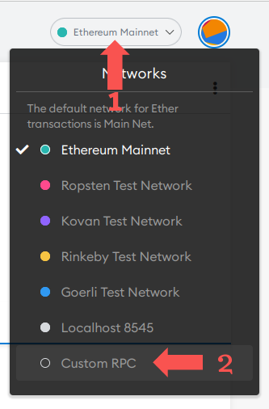
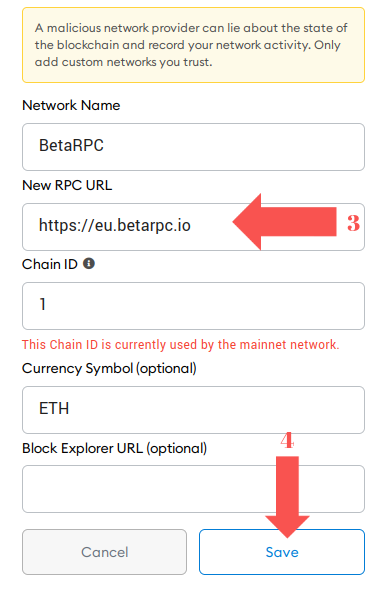
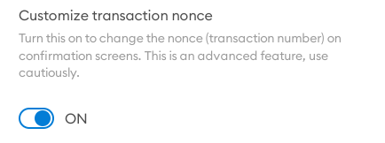

# WARNING: THIS PROJECT IS NOT MAINTAINED SINCE OCTOBER 2021
At the moment there're far better maintained alternatives so if you experience any issues, just switch to them instead.

# BetaRPC-setup

BetaRPC is the most feature-rich RPC endpoint for DeFi wallets. By aggregating majority of public+private RPC endpoints as well as MEV relays(like FlashBots) and leveraging smart routing between them it provides numerous benefits to its users:
1) Mitigates negative externalities of MEV(like front-running or sandwiches)
2) Protects against failed transactions via MEV bundles when necessary(don't pay gas fee for failed NFT mints)
3) Back-runs all eligible transactions and provides full rebate to its users
4) And you receive all benefits above for free without sacrificing speed of transaction confirmation when MEV protection isn't necessary like simple ETH or token transfers.

## Nodes

* Europe：`https://eu.betarpc.io`
* North America：`https://us.betarpc.io`

## MetaMask integration

To make sure that you can leverage all features of BetaRPC and capable of "un-stucking" pending transactions it's also highly recommended to enable ability to set "Transaction Nonce" manually, this option can be found under `Settings` -> `Advanced`:  

## Why BetaRPC?
Using betarpc.io provides advantages on following fronts:  
(I) Speed of transaction confirmation  
(II) Mitigating payment for failed transactions  
(III) Uncle insurance fund[EXPERIMENTAL]  
(IV) No extra fees and minimal logging  

## (I) Speed of transaction confirmation
More than 99% of ETH transactions aren't affected by MEV in any way and yet using TaiChi network you have to wait 2-4x longer and use "high" gas price for 100% of submitted transactions.  
betarpc.io approaches it on two ways:  
(A) ML model at BetaRPC predicts which transactions have to be routed privately and only does it for ~1% of affected transactions  
(B) Improved coverage: it integrates TaiChi and all MEV relays: Flashbots/Ethermine/BloxRoute/Archer/MiningDAO.  

## (II) Mitigating payment for failed transactions
Using simulation + another ML model endpoint predicts probability that transaction would fail in the block where it's included on-chain.  
If probability is too high it only uses Bundle relayers to avoid payment for failed stuff  

## (III) Uncle insurance fund
Some blocks become uncles and all transactions go into mempool.  
I'll setup a bot to fight in MEVA auctions to include BetaRPC transactions from mem-pool completely unharmed.  
This will be applied only for txs which can be negatively affected by MEV.  
Uncle insurance fund is obviously not incentive compatible and is provided as-is without any guarantees whatsoever.  
It will be funded by any MEV that doesn't negatively affect BetaRPC users in any way like back-running.  

## (IV) No extra fees and minimal logging 
Endpoint is provided completely for free  
This endpoint will not save your IP or any personally identifiable information because it's none of my business.  
I'll also spin-up otterscan(https://github.com/wmitsuda/otterscan) instance to show any pending txs

## Competition
There are several other endpoints which provide comparable MEV protection, but none of them match all the features available for BetaRPC users:
1) TaiChi network by SparkPool: https://github.com/Taichi-Network/docs/blob/master/sendPriveteTx_tutorial.md
2) BackRunMe endpoint by BloxRoute: https://docs.bloxroute.com/introduction/backrunme#metamask-custom-rpc
3) EDEN network endpoint: https://docs.edennetwork.io/for-traders/eden-relay/eden-rpc  

There's also FlashBots MEV relay endpoint:  
https://relay.flashbots.net  
Though it can't be used directly within MetaMask at the moment.

## TBD
At the moment main priority is to make this endpoint completely stable and tune accuracy of underlying ML models to the limit.
Code quality is still low("experimental" stage), but I'll try to open source main logic + ML models so you can run limited version locally with your own full node. Though it's not high-pri since main audience("beta" traders) don't run their own full nodes. 
